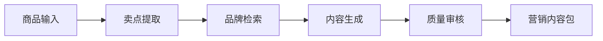

# MarketCraft AI

面向电商运营团队的多模态营销内容生产 Agent 平台。系统接收商品资料和图片，自动提取卖点、检索品牌规范、生成多平台文案与海报提示词，并通过质量审核节点输出可追溯的营销内容包。

当前版本为 Phase 1 MVP：核心后端链路已实现，默认使用 Mock（模拟）生成器，无需模型密钥即可演示。项目不是一个单独的“调用大模型接口”Demo，而是把确定性规则、品牌约束、生成模型和人工审核组织为可扩展工作流。

## Core workflow



## Current capabilities

- FastAPI 版本化接口和 Pydantic 参数校验
- LangGraph 状态工作流、线程 ID 和 Checkpoint（检查点）
- 小红书、抖音、淘宝、京东平台文案结构
- 品牌语气与品类规则检索接口
- 禁用词、绝对化表述、标题长度和可读性检查
- 完整节点执行轨迹，方便评测、排错和面试演示
- Mock 模式、自动化测试、Docker 镜像与健康检查

## Quick start

```bash
cp .env.example .env
python -m venv .venv
source .venv/bin/activate
pip install -e ".[dev]"
uvicorn app.main:app --reload
```

打开 `http://localhost:8000/docs` 查看接口文档，或运行 `examples.http` 中的示例请求。

```bash
pytest
```

Docker 启动：

```bash
cp .env.example .env
docker compose up --build
```

## API

`POST /api/v1/campaigns/generate`

输入包含商品 SKU、名称、品类、描述、结构化属性、目标用户、平台与品牌 ID。输出包含：

- 可追溯商品卖点
- 本次使用的品牌规则
- 各平台标题、正文、标签和行动引导
- 可交给图像模型的海报 Prompt（提示词）
- 质量分数、风险项、审核状态和节点轨迹

完整请求示例见 [examples.http](examples.http)。

## Delivery roadmap

| Phase | Deliverable | Interview value |
| --- | --- | --- |
| 1 | 商品输入 → 文案 → 海报 Prompt → 质检 | FastAPI、LangGraph、结构化输出、异常与质量控制 |
| 2 | 商品图片理解、真实 LLM、海报生成 | 多模态模型、Prompt 工程、供应商抽象 |
| 3 | 品牌 RAG、商品库、混合召回 | Milvus、BM25、Rerank、引用溯源 |
| 4 | 人工审核、版本管理、多平台发布 | Human-in-the-loop、权限、幂等与审计 |
| 5 | 评测、监控、Redis/PostgreSQL、部署 | 生产评测、可观测性、可靠性与工程化 |

## Engineering decisions

- 使用 Workflow（固定工作流）作为主链路，保证营销生产过程稳定、可审计；只在创意生成和工具选择等局部使用 Agent 自主性。
- 所有生成器都通过 `ContentGenerator` 接口接入，Mock、OpenAI 兼容接口或本地模型可以互换。
- 生成结果必须经过独立质量节点，不能让同一次生成直接充当审核结论。
- 第一阶段用内存 Checkpointer 降低启动成本，生产版迁移至 Redis/PostgreSQL。

更完整的设计见 [docs/ARCHITECTURE.md](docs/ARCHITECTURE.md)。

