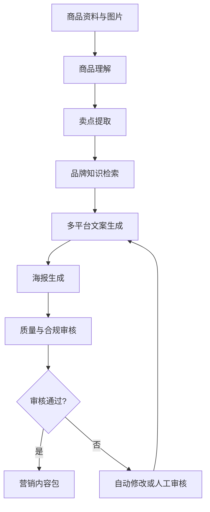

# MarketCraft AI Architecture

## Product flow

## Phase 1 modules

| Module | Responsibility | Current implementation |
| --- | --- | --- |
| API | Input validation and versioned endpoints | FastAPI + Pydantic |
| Workflow | Deterministic orchestration and state trace | LangGraph StateGraph |
| Product understanding | Extract traceable selling points | Mock provider interface |
| Brand retrieval | Apply brand voice and compliance rules | Local JSON repository |
| Content generation | Generate platform-specific copy | Deterministic mock provider |
| Quality gate | Detect prohibited claims and readability risks | Rule engine + score |
| Persistence | Resume by thread and retain workflow state | InMemorySaver for MVP |

## Production evolution

Phase 2 adds a production LLM provider, structured visual analysis and a dedicated poster generator while preserving keyless Mock mode.
Phase 3 adds a product catalog and hybrid brand retrieval. Local mode implements BM25, dense retrieval and RRF in memory; production mode uses Milvus native BM25, a dense vector field, metadata filters and the same RRF strategy.
Phase 4 adds human approval, content versioning and publishing adapters.
Phase 5 adds evaluation datasets, tracing, monitoring, Redis persistence and deployment hardening.
