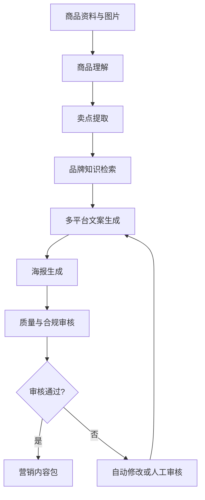
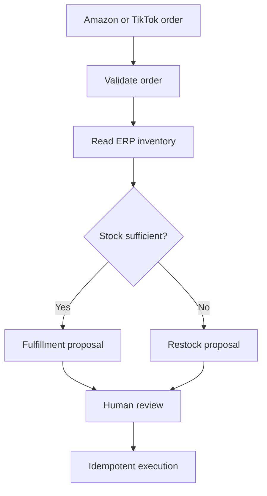
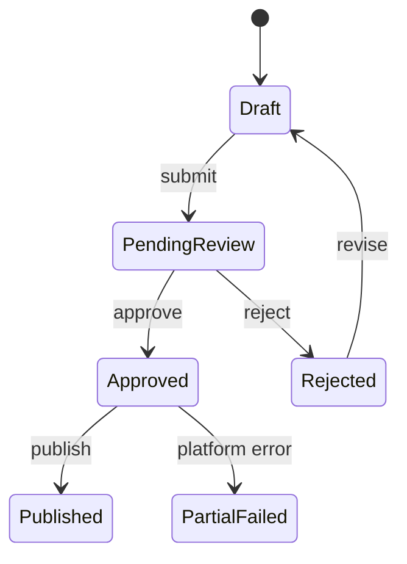

# MarketCraft AI Architecture

## Product flow

## Phase 1 modules

| Module | Responsibility | Current implementation |
| --- | --- | --- |
| API | Input validation and versioned endpoints | FastAPI + Pydantic |
| Workflow | Deterministic orchestration and state trace | LangGraph StateGraph |
| Product understanding | Extract traceable selling points | Mock provider interface |
| Brand retrieval | Apply brand voice and compliance rules | Local JSON repository |
| Content generation | Generate platform-specific copy | Deterministic mock provider |
| Quality gate | Detect prohibited claims and readability risks | Rule engine + score |
| Persistence | Resume workflows and retain domain state | InMemorySaver + pluggable JSON state store |

## Production evolution

Phase 2 adds a production LLM provider, structured visual analysis and a dedicated poster generator while preserving keyless Mock mode.
Phase 3 adds a product catalog and hybrid brand retrieval. Local mode implements BM25, dense retrieval and RRF in memory; production mode uses Milvus native BM25, a dense vector field, metadata filters and the same RRF strategy.
Phase 4 adds human approval, immutable content versions, append-only audit events and idempotent publishing adapters. Platform credentials are deliberately excluded from the repository; without them, adapters return explicitly labelled Mock results.
Phase 5 adds SQLAlchemy state persistence, Redis-backed publication idempotency, Prometheus metrics, a versioned retrieval evaluation set and CI regression gates. Docker Compose describes an API, PostgreSQL and Redis deployment topology.
Phase 6 adds a second LangGraph workflow for cross-border order operations. A platform gateway pulls Amazon or TikTok Shop orders, an ERP gateway reads stock, and the workflow recommends fulfillment or replenishment. Every external write pauses for four-eyes approval.
Phase 7 adds a zero-build operations console served by FastAPI. It consumes the same public API used by external clients and does not bypass domain services or approval rules.

## Order operations flow

The workflow itself is read-only. It produces inventory evidence, a recommendation, risk flags and a trace. Only the separately approved execution service can reserve stock, create a fulfillment or create a replenishment task. This boundary prevents an LLM or workflow node from directly mutating business systems.

## Operations console

`/dashboard` is a responsive HTML/CSS/JavaScript client with no Node build step. It shows KPI summaries, operation runs, inventory evidence, risk flags, approval identity, workflow trace and external execution results. The quick-demo form writes only to the configured adapters; in default mode every destination is explicitly labelled Mock.

## Content lifecycle

An approved version is immutable. Any edit creates a new version in Draft status, and the reviewer must differ from the submitter. Publication uses an idempotency key scoped to the campaign version so retries return the original result instead of creating duplicate posts.

## Persistence and deployment modes

| Concern | Local default | Deployable adapter | Selection |
| --- | --- | --- | --- |
| Workflow checkpoint | LangGraph memory saver | External checkpointer can replace it | Application wiring |
| Product and campaign state | In-memory JSON store | SQLAlchemy: SQLite or PostgreSQL | `PERSISTENCE_MODE` |
| Publication idempotency | In-memory TTL store | Redis TTL store | `IDEMPOTENCY_MODE` |
| Retrieval | In-memory hybrid retrieval | Milvus hybrid retrieval | `RETRIEVAL_MODE` |
| Generation and publishing | Deterministic Mock providers | OpenAI and platform adapters | Provider settings |
| Orders and fulfillment | Mock Amazon/TikTok/ERP gateways | Official APIs behind protocols | Dependency injection |
| Review notification | Mock Feishu notifier | Feishu bot or approval API | Dependency injection |

State is serialized through Pydantic models so the same domain schema is used by memory and database implementations. Idempotency records include campaign and version ownership; reusing a key for a different version is rejected.

## Observability and evaluation

The ASGI middleware records normalized-route request counts and duration. Domain counters track campaign generation, publication, order recommendations and operation execution outcomes, and `/metrics` exposes the Prometheus text format.

`data/eval/retrieval.json` is a small, version-controlled regression dataset. `python -m scripts.evaluate_rag --top-k 1` reports Recall@K, MRR and citation coverage and is executed by CI. It is an engineering regression gate, not a claim of production retrieval quality.

## Verification status

Memory and SQLite modes, lifecycle restoration, idempotent Mock publishing, order fulfillment/replenishment decisions, failure isolation, metrics, and the evaluation runner are covered by automated tests. PostgreSQL, Redis, real platform credentials, Feishu and remote model providers require environment-specific integration tests before production use.
